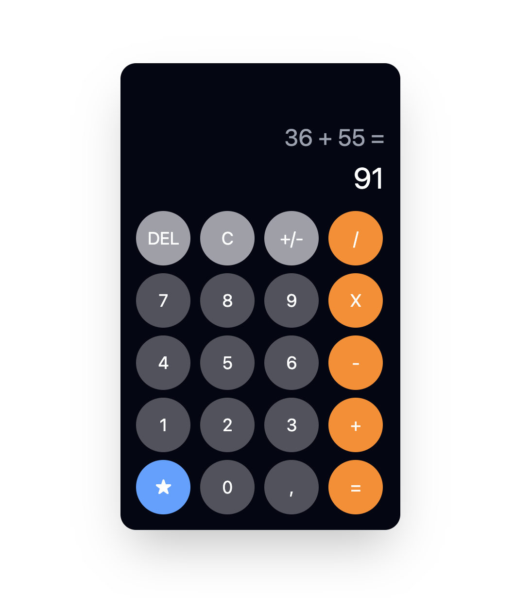

# Calculator App (React + TypeScript)

This is a simple but fully functional calculator application built with **React** and **TypeScript**.  
The project is based on a Vanilla JavaScript version that I originally developed three months ago as a JavaScript exercise.  
Since I am currently learning React, I refactored the entire project into **React + TypeScript**.

This is my **second TypeScript project** and my **first React project**.

---

## Features

- Basic arithmetic operations: addition, subtraction, multiplication, division  
- Toggle sign (+/-)  
- Decimal support  
- Delete last digit (DEL)  
- Full reset (C)  
- Calculation via `=`  
- Display of the last operation  
- Component-based architecture  
- Fully typed with TypeScript  

---

## Tech Stack

- React  
- TypeScript
- TailwindC

---

## Setup & Installation

npm install
npm run dev

---

## Project Structure

- `App.tsx` – main calculator logic and state management  
- `components/` – reusable UI components (buttons, labels, containers)  
- `types/` – type definitions such as operators  
- `styles/` – styling  

---

## Notes

This project helped me understand:

- how to manage state in React  
- how to refactor JS logic into TS  
- how to structure UI components  
- how to handle numeric state updates correctly  

More improvements may follow as I continue learning React and TypeScript.
